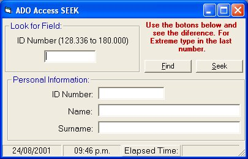



## Acces ADO and Seek

### Description

It's not true you can't use Seek with ADO in Access.
 
### More Info
 

             |
---                |---
**Submitted On**   |2002-12-16 09:24:24
**By**             |[Maximiliano Gil Toro](https://github.com/Planet-Source-Code/PSCIndex/blob/master/ByAuthor/maximiliano-gil-toro.md)
**Level**          |Advanced
**User Rating**    |4.6 (32 globes from 7 users)
**Compatibility**  |VB 6\.0
**Category**       |[Databases/ Data Access/ DAO/ ADO](https://github.com/Planet-Source-Code/PSCIndex/blob/master/ByCategory/databases-data-access-dao-ado__1-6.md)
**World**          |[Visual Basic](https://github.com/Planet-Source-Code/PSCIndex/blob/master/ByWorld/visual-basic.md)
**Archive File**   |[Acces\_ADO\_152243122003\.zip](https://github.com/Planet-Source-Code/maximiliano-gil-toro-acces-ado-and-seek__1-42059/archive/master.zip)

